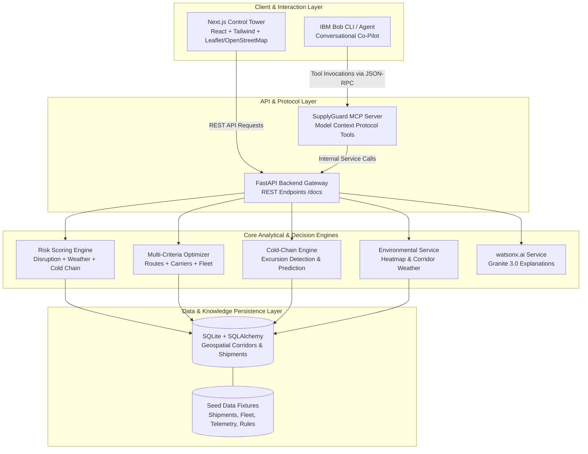

# System Architecture — SupplyGuard AI

## System Architecture

SupplyGuard AI is structured as a decoupled, service-oriented architecture designed to handle real-time geospatial analysis, telematics monitoring, deterministic optimization, and agentic AI co-piloting.



---

## Component Breakdown

| Component | Technology | Responsibility |
|---|---|---|
| **Next.js Control Tower** | Next.js 14, React, Tailwind CSS, Leaflet, react-leaflet, OpenStreetMap tiles | Interactive operations console rendering shipment roster, risk gauges, cold-chain panels, disruption monitor, fleet match panel, Leaflet map, and AI brief panels. |
| **Backend API Gateway** | Python 3.11+, FastAPI, Pydantic v2, Uvicorn | High-performance RESTful API orchestrating analytical engines, parameter validation, and client routing. |
| **Risk Scoring Engine** | Python, NumPy, Pandas | Deterministic multi-variable risk calculator generating normalized (0–100) scores for shipments, corridors, and delays. |
| **Optimization Engine** | Pure-Python min-max normalization | Multi-objective routing score and idle fleet redeployment matcher based on distance, cargo suitability, and weather/disruption factors. |
| **Cold-Chain Engine** | Python, time-series comparison | Evaluates telematics streams against cargo temperature bounds; computes excursion durations and classifies severity against regulatory cargo rules. |
| **watsonx.ai Integration** | `ibm-watsonx-ai` SDK, IBM Granite 3.0 | Translates structured engine metrics into executive summaries, action plans, and natural language explanations without hallucinations; deterministic fallback when credentials absent. |
| **MCP Server** | Python MCP SDK (stdio transport) | Exposes 10 operational supply-chain tools to IBM Bob, enabling autonomous inquiry and dispatch action. |
| **Database** | SQLite + SQLAlchemy 2.0 | Stores shipments, fleet, telemetry, routes, disruptions, weather, cargo rules. *PostgreSQL + PostGIS is a documented future roadmap item for polygon-based geofencing.* |

---

## End-to-End Data Flow

```mermaid
sequenceDiagram
    autonumber
    actor Dispatcher as Operations Dispatcher
    participant FE as Next.js Control Tower
    participant API as FastAPI Backend
    participant CC as Cold Chain Engine
    participant OPT as Optimization Engine
    participant AI as watsonx.ai Service
    participant MCP as MCP Server
    participant Bob as IBM Bob

    Note over API,CC: 1. Continuous Ingestion & Monitoring
    API->>CC: Ingest IoT Telemetry & Corridor Forecast
    CC->>CC: Detect out-of-range sensor readings & predict thermal exposure
    
    Note over Dispatcher,FE: 2. Disruption Trigger & Detection
    Dispatcher->>FE: Inspect active Winter Storm DIS-501 / Cold-Chain Excursion SHP-1002
    FE->>API: GET /api/disruptions/DIS-501/affected-shipments
    API->>FE: Return affected shipments near DIS-501 with elevated risk scores
    
    Note over FE,OPT: 3. Automated Mitigation & Optimization
    FE->>API: GET /api/shipments/SHP-1002/routes
    API->>OPT: Compute feasible route scores and fleet match
    OPT->>API: Return route recommendations and fleet-match result for SHP-1002
    
    Note over API,AI: 4. Narrative Synthesis
    API->>AI: Generate explanation for SHP-1002 disruption risk
    AI->>API: Return auditable natural language operational rationale
    API->>FE: Display AI brief panel with headline and recommended action
    
    Note over Bob,MCP: 5. Agentic Co-Pilot Inquiry
    Bob->>MCP: Call tool: evaluate_shipment_risk(shipment_id="SHP-1002")
    MCP->>API: Fetch live risk evaluation
    API->>MCP: Return structured risk score and sub-scores
    Bob->>Dispatcher: Deliver actionable risk assessment and mitigation options
```

---

## Core Mathematical Formulations

### 1. Shipment Risk Scoring
$$\text{Shipment Risk} = 0.30 \times R_{\text{disruption}} + 0.25 \times R_{\text{weather}} + 0.20 \times R_{\text{route}} + 0.15 \times R_{\text{cold\_chain}} + 0.10 \times R_{\text{business}}$$
- **Normalized Scale:** 0 to 100.
- **Classification:** 0–25 `LOW` | 26–50 `MEDIUM` | 51–75 `HIGH` | 76–100 `CRITICAL`.

### 2. Candidate Route Optimization
$$\text{Score}_{\text{route}} = 0.30 \times (1 - \hat{\text{ETA}}) + 0.20 \times (1 - \hat{\text{Cost}}) + 0.25 \times (1 - \hat{E}_{\text{disruption}}) + 0.15 \times (1 - \hat{E}_{\text{weather}}) + 0.10 \times (1 - \hat{E}_{\text{cold\_chain}})$$
*(Where all hat variables represent min-max normalized factors).*

### 3. Idle Fleet Asset Matching
$$\text{Score}_{\text{fleet}} = 0.30 \times \text{Proximity} + 0.25 \times \text{Cargo Compatibility} + 0.20 \times \text{Refrigeration Match} + 0.15 \times \text{Capacity Match} + 0.10 \times \text{Availability}$$

---

## Data Models & Schema

- **`shipments`**: ID, origin, destination, current GPS coordinates, cargo type, cargo value, status, required temp bounds ($T_{\min}, T_{\max}$), assigned carrier, ETA.
- **`fleet_assets`**: ID, vehicle type, current coordinates, status (`IDLE`, `EN_ROUTE`), capacity (kg), refrigeration specs, temp range capability, fuel/battery level.
- **`disruptions`**: ID, category (`PORT_STRIKE`, `SEVERE_WEATHER`, `ROAD_CLOSURE`), geometry polygon / radius, severity, delay factor, active window.
- **`weather`**: Station ID, coordinates, ambient temperature, precipitation, wind speed, road condition, forecast vector.
- **`telemetry`**: Sensor ID, vehicle ID, shipment ID, timestamp, cargo temperature, humidity, vibration, compressor operational mode, GPS vector.
- **`cargo_rules`**: Cargo classification, regulatory standard (e.g., WHO TRS 961), allowable excursions, maximum duration before critical status.
- **`routes`**: ID, corridor name, origin/destination, distance, typical transit time, waypoints, known cold-storage depots.
- **`carriers`**: ID, carrier name, compliance rating, on-time delivery rate, active fleet size, certifications.

---

## Security & Reliability Considerations

1. **Zero Secret Leakage:** No credentials, API tokens, or database passwords are hardcoded or tracked in Git. All secrets load via `.env` (validated against `.env.example`).
2. **CORS & Input Validation:** Strict Pydantic models validate all incoming API payloads; CORS middleware restricts unauthorized origins.
3. **Sandboxed AI Invocations:** watsonx.ai receives structured JSON dictionaries rather than raw database dumps or unbounded system prompts, preventing prompt injection and data exfiltration.
4. **Deterministic Auditing:** LLM output is paired with mathematical proof points, ensuring full reproducibility and auditability for regulatory bodies.

---

## Scalability & Production Roadmap

- **Horizontal Scaling:** FastAPI instances run stateless behind Nginx or AWS ALB.
- **Event Streaming:** Ingest high-velocity IoT streams using Apache Kafka or AWS Kinesis into a TimescaleDB time-series hypertable.
- **Distributed Optimization:** Offload complex multi-depot vehicle routing problems (VRP) to Celery/Redis worker pools executing OR-Tools or cuGraph.
- **Edge Intelligence:** Deploy lightweight predictive cold-chain scoring models directly onto reefer IoT telematics units for disconnected in-transit alerting.
