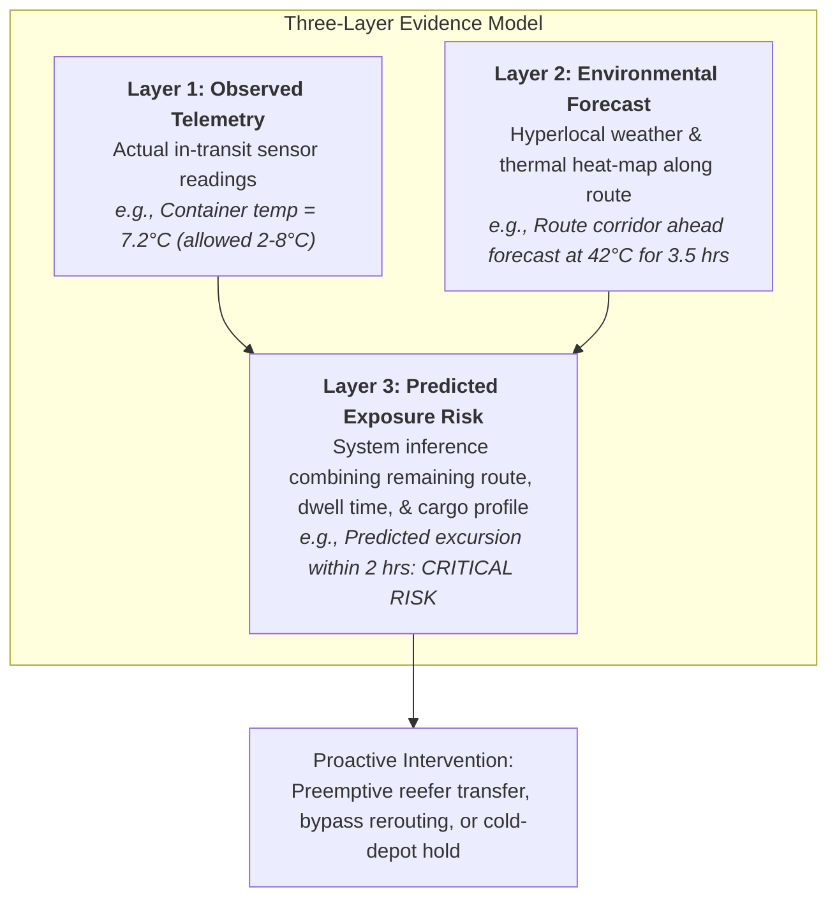

# Solution Overview — SupplyGuard AI

## What We Built

**SupplyGuard AI** is an autonomous L2 supply-chain disruption control tower and fleet utilization optimizer. It proactively identifies in-transit shipments threatened by active infrastructure disruptions and extreme weather, projects cold-chain exposure risks before breaches occur, matches idle refrigerated fleet assets, and generates ranked multi-criteria route and carrier mitigations.

Powered by a **FastAPI deterministic risk and optimization engine**, **watsonx.ai**, and an **MCP (Model Context Protocol) server**, SupplyGuard AI equips enterprise dispatchers and AI agents (such as IBM Bob) with real-time operational decision support.

```
       Observe ──────► Assess ──────► Predict ──────► Optimize ──────► Recommend ──────► Act
 (IoT / Weather /   (Disruptions /  (Environmental   (Multi-Criteria   (watsonx.ai /     (Automated Dispatch
   GPS / Fleet)      Excursions)      Exposure)        Routing &        IBM Bob Tool     / Redeployment)
                                                        Fleet)           Invocations)
```

---

## Core Product Differentiator: The Three-Layer Evidence Model

SupplyGuard AI does not attempt to replace physical IoT sensors with weather maps. Instead, it unifies physical telematics with forward-looking environmental intelligence into a **three-layer evidence model**:



1. **Observed (Physical State):** Continuous telematics streams (cargo temperature, humidity, compressor status, GPS coordinates, door state).
2. **Environmental (External Hazard):** Hyperlocal weather, severe storm alerts, and road-surface thermal conditions overlaid along active transit corridors.
3. **Predicted (Forward-Looking Inference):** Deterministic calculations estimating cumulative thermal load and transit delays, identifying cold-chain breach probabilities *hours before* physical container limits fail.

---

## The Four Core Capabilities

### 1. Disruption Impact Engine
- Monitors active disruption zones (port strikes, highway washouts, winter storms, geopolitical choke points).
- Employs geospatial radius and corridor intersection algorithms to determine exactly which shipments, cargo categories, and customer SLAs are impacted.
- Quantifies estimated transit delay hours and business cost exposure.

### 2. Multi-Criteria Route & Carrier Optimization
- Automatically calculates alternative corridors when primary routes are compromised.
- Evaluates candidate routes across a weighted multi-factor objective:
  $$\text{Route Score} = 0.30 \times \text{ETA} + 0.20 \times \text{Cost} + 0.25 \times \text{Disruption Avoidance} + 0.15 \times \text{Weather Risk} + 0.10 \times \text{Cold Chain Exposure}$$
- Ranks vetted carriers by refrigerated capability, historical SLA reliability, current fleet availability, and tariff rates.

### 3. Intelligent Fleet Utilization & Redeployment
- Continuously indexes fleet status to identify idle prime movers, refrigerated trailers, and cryo-containers.
- Matches idle assets to distressed shipments based on geospatial proximity, cargo capacity, and cooling specifications.
- Reduces deadhead miles and asset downtime while rescuing temperature-sensitive loads.

### 4. Cold-Chain Integrity & Regulatory Compliance
- Ingests IoT telemetry against standardized cargo profiles (e.g., WHO Grade A Pharma, Ultra-Cold Cryo, Perishable Frozen).
- Classifies excursions by duration and allowable excursion limits (Warning, High, Critical).
- Triggers automated mitigation protocols before regulatory safety boundaries are violated.

---

## Human-in-the-Loop AI & IBM Bob Integration

Rather than allowing an LLM to hallucinate operational metrics, SupplyGuard AI adheres to strict architectural boundaries:

1. **Deterministic Backend Engine:** All risk scores, geospatial intersections, route costs, and fleet matches are computed deterministically in Python/FastAPI.
2. **watsonx.ai Reasoning & Synthesis:** watsonx.ai ingests the structured analysis output to synthesize operator-ready briefs, explain why a specific detour was chosen, and highlight critical trade-offs.
3. **Model Context Protocol (MCP) & IBM Bob:** An enterprise MCP server exposes operational tools directly to IBM Bob CLI and agentic workflows. Dispatchers can query IBM Bob in natural language (e.g., `"What is the risk level for shipment SHP-1002 and which fleet asset can support it?"`), and Bob executes real tools (`evaluate_shipment_risk`, `match_fleet_asset`) to inspect and resolve the situation.

---

## Key Design Decisions

| Decision | Alternative Considered | Rationale |
|---|---|---|
| **Deterministic Risk Engine + LLM Explainer** | Pure end-to-end LLM decision making | Logistics decisions require auditable, repeatable, and mathematically sound calculations. LLMs explain and summarize; deterministic algorithms compute. |
| **Three-Layer Evidence Model** | Telemetry-only alerting | Telemetry-only systems are reactive. Environmental predictive layers enable intervention before thermal failure. |
| **FastAPI + Next.js + MCP Architecture** | Monolithic framework | Decouples computational microservices, geospatial map rendering, and AI agent integration into scalable, modular services. |
| **PostgreSQL / PostGIS Geospatial Layer** *(roadmap — prototype uses SQLite)* | In-memory geospatial checks | PostGIS enables spatial corridor indexing, radius queries, and realistic route intersection calculations at scale. Prototype uses SQLite with Haversine-based radius checks. |
| **Pre-configured Seed Scenarios** | Uncontrolled live web scraping | Ensures 100% reproducible, reliable, and testable hackathon demonstration runs without third-party API rate-limit failures. |

---

## IBM Technologies Used

- **IBM watsonx.ai:** Generates structured operational summaries, incident root-cause explanations, and dispatch directives using Granite 3.0 models.
- **IBM Bob:** Serves as the conversational operational co-pilot for dispatchers, executing real-world tool calls through MCP to query shipments, assess disruptions, and invoke fleet redeployments.
- **Model Context Protocol (MCP):** Standards-compliant server exposing 10 granular supply-chain operational tools to agentic runtimes.
